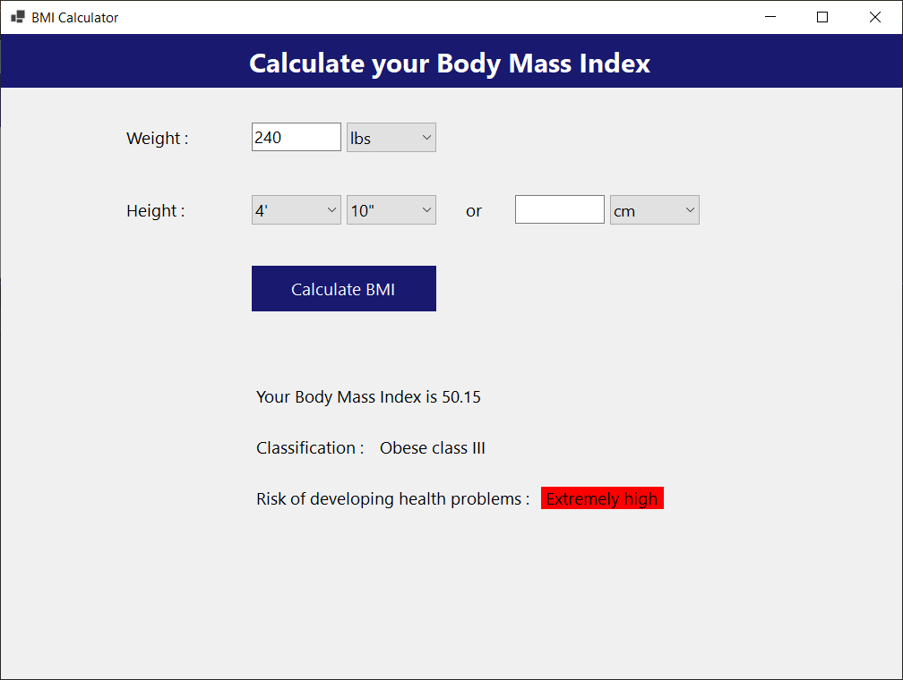

# BMI Calculator

This project is a simple BMI (Body Mass Index) Calculator developed using C# and Windows Forms. The application allows users to input their height and weight, select measurement units, and calculate their BMI easily.

## Features

- User-friendly interface
- Input validation for height and weight
- Option to select measurement units
- Calculates BMI and provides a weight category based on the result

## Technologies Used
* C#
* .NET 8
* Windows Forms
* Visual Studio

## Usage
1. Input your height and weight.
2. Select your measurement units (Metric or Imperial) from the dropdown.
3. Click the `Calculate BMI` button to get your BMI.
4. The application will display your BMI value and categorize your weight status.

## Screenshots

https://github.com/user-attachments/assets/8f21ea4f-c15c-4738-a647-cd012eadaf9f

 

  
  
  
  
  

