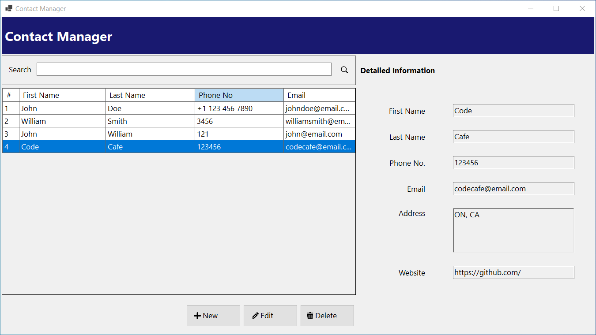
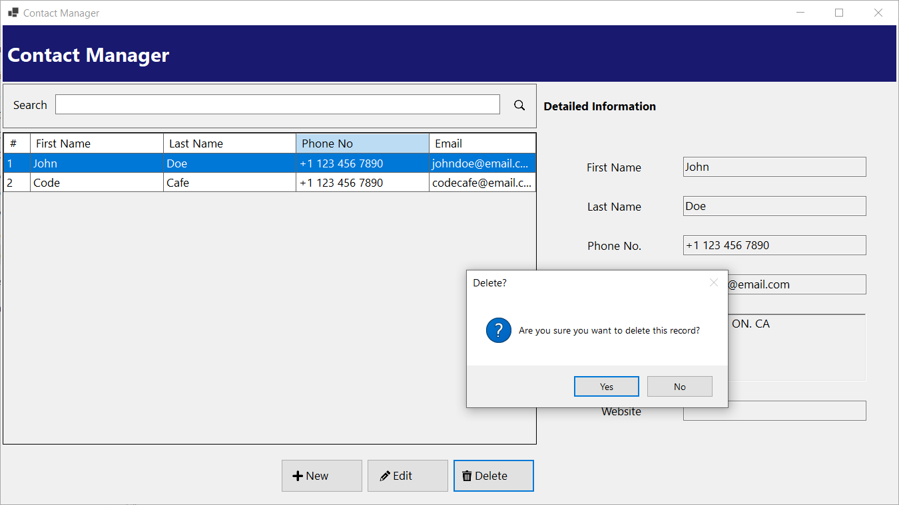
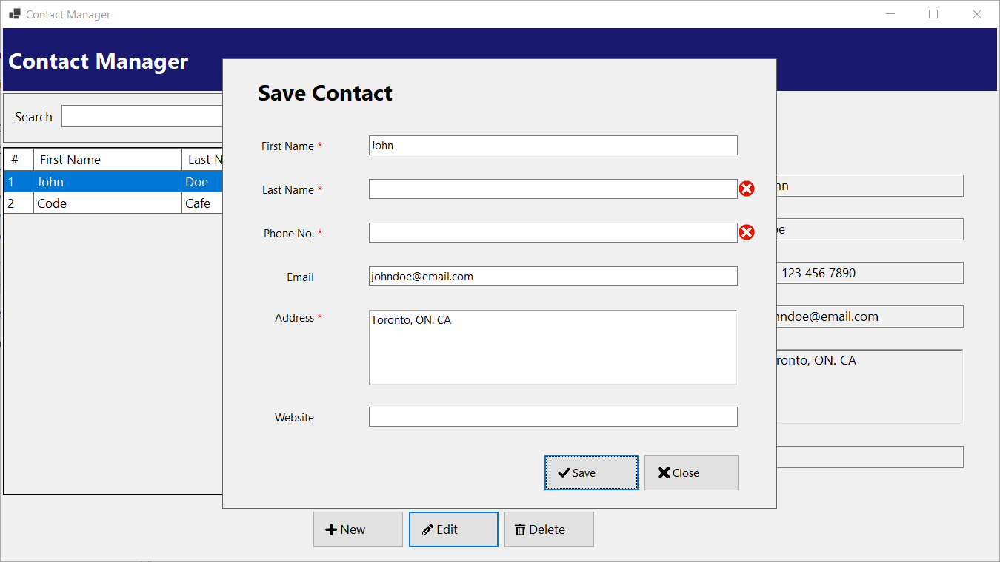
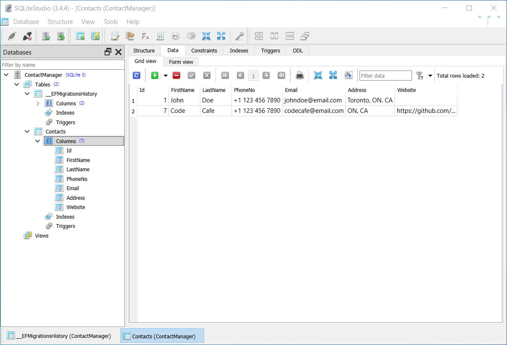

# ContactManager

ContactManager is a Windows Forms application developed using .NET 8, C#, and Entity Framework Core with an SQLite database. This application allows users to manage their contacts with full CRUD (Create, Read, Update, Delete) functionality.

## Features

- **Create**: Add new contacts to the database.
- **Read**: View a list of all contacts.
- **Update**: Modify existing contact details.
- **Delete**: Remove contacts from the database.

## Technologies Used

- **Framework**: .NET 8
- **Language**: C#
- **Database**: SQLite
- **ORM**: Entity Framework Core
- **UI**: Windows Forms

## UI Components

The application utilizes a variety of UI elements, including:

- Labels
- Textboxes
- Table Layout Panels
- Panels
- Data Grid View

## Screenshots

https://github.com/user-attachments/assets/5752a4cb-a9b9-47e5-8d40-fdafddc777f4

 

  
  
  
  

## Acknowledgments
Thanks to [UXWing](https://uxwing.com) for their incredible collection of icons.
