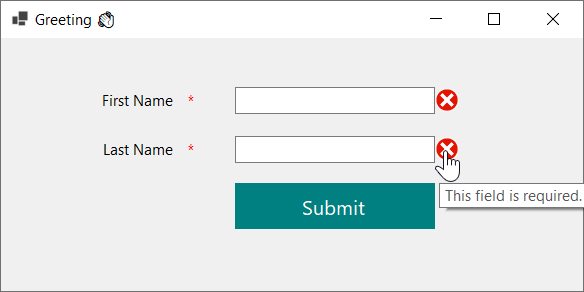
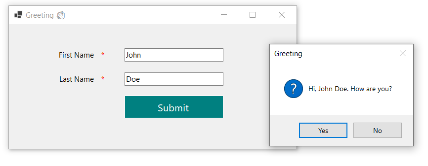
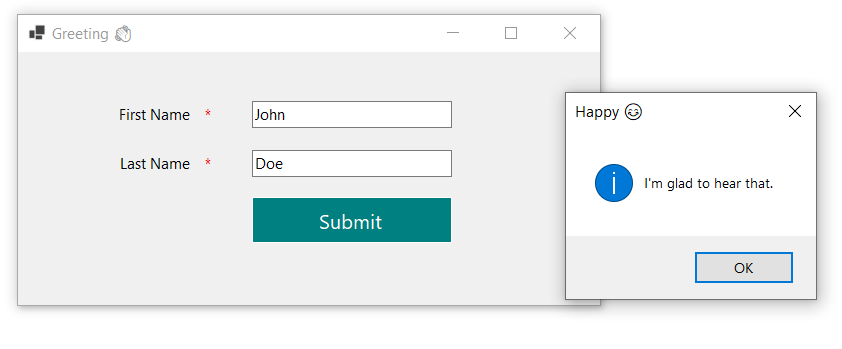
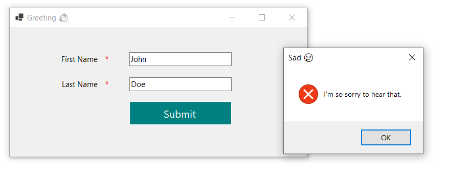

# Greeting

This project demonstrates the setup of a Windows Forms application in C# and showcases the use of various UI elements such as `Label`, `TextBox`, `Button`, and `MessageBox`.

## Features

- **User Input**: Accepts user input through a TextBox.
- **Dynamic Greeting**: Displays a personalized greeting message in a MessageBox when the button is clicked.
- **Simple UI**: Intuitive layout that makes it easy for users to interact with the application.

## Technologies Used
* C#
* .NET 8
* Windows Forms

## How It Works
The application consists of a simple form with the following elements:
- **Label**: Displays a prompt for the user to enter their name.
- **TextBox**: Allows the user to input their name.
- **Button**: When clicked, retrieves the name from the `TextBox` and displays a greeting in a `MessageBox`.

## Screenshots

 

  
  
  
  

