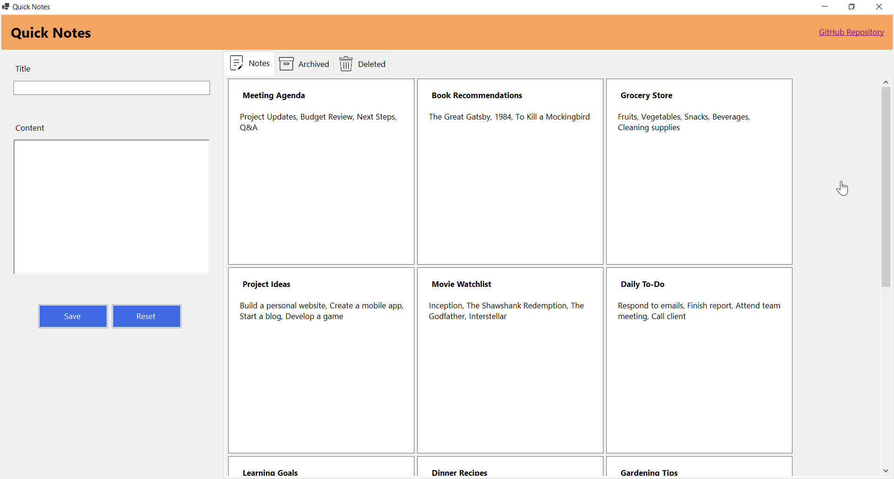
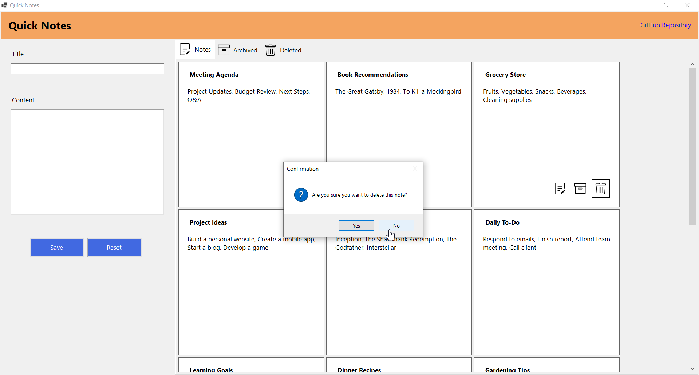
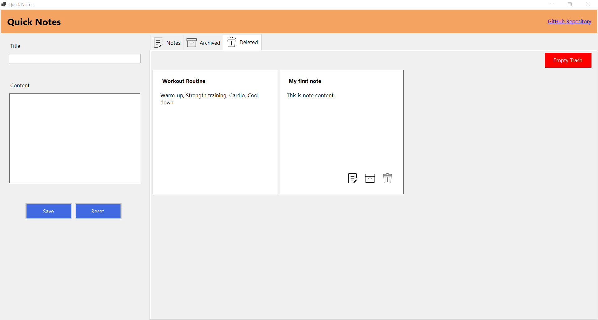
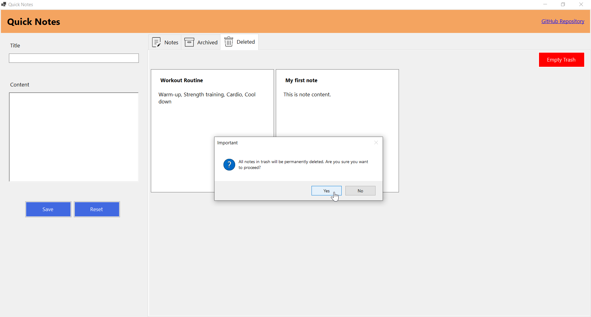

# QuickNotes - Simple Note Taking Application

**QuickNotes** is a simple note-taking application using C# and .NET 8, with a focus on best practices like the Repository Pattern and Dependency Injection.

## Features

- Create, read, update, and delete notes
- Simple user interface
- Persistent storage with SQLite
- Logging capabilities with NLog
- Organized code structure using the Repository Pattern

## Technologies Used

- **Framework**: .NET 8
- **Language**: C#
- **Database**: SQLite
- **ORM**: Entity Framework Core
- **UI**: Windows Forms
- **Logging**: NLog
- **Repository Pattern**
- **Dependency Injection**

## UI Components

The application utilizes a variety of UI elements, including:

- Labels
- Textboxes
- Table Layout Panels
- Panels
- Tab Control

## Entity Framework - Migration
Run the following codes in `Package Manager Console` by setting `QuickNotes.UI` as default project.
```bash
Add-Migration InitialCreate -Project QuickNotes.Data
```
```bash
Update-Database
```

## Screenshots


<br/>
<p align="center">
  
  
  
  
</p>

## Acknowledgments
Thanks to [UXWing](https://uxwing.com) for their incredible collection of icons.
