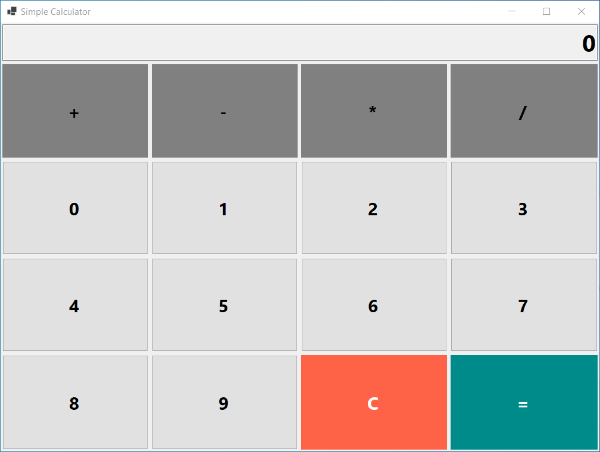

# SimpleCalculator

This C# Windows Forms application performs basic arithmetic operations, including addition, subtraction, multiplication, and division. The application is built using .NET 8 and features a responsive layout implemented with a TableLayoutPanel.

## Features

- **Basic Arithmetic Operations**: Perform addition, subtraction, multiplication, and division.
- **Responsive Design**: Utilizes TableLayoutPanel for a clean and adaptable user interface.
- **User-Friendly Interface**: Simple and intuitive design for easy interaction.

## Technologies Used
* C#
* .NET 8
* Windows Forms
* Visual Studio

## Screenshots
https://github.com/user-attachments/assets/48a2381a-1b70-4c6f-ae41-105ed5359a5d

 

  

